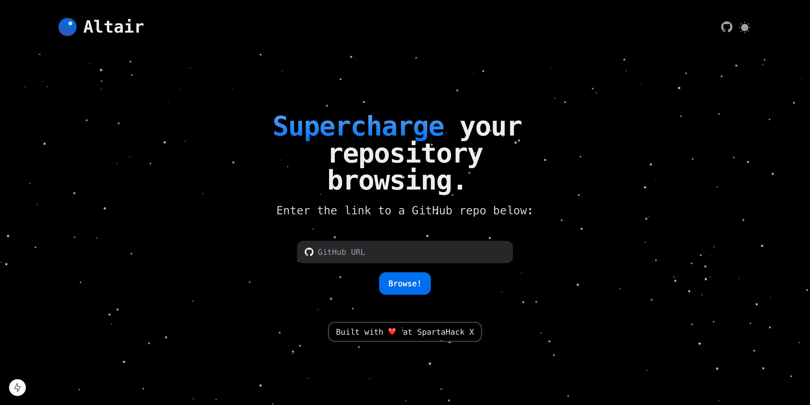

<h1 align="center">
<a href="https://devpost.com/software/cascade-xrfscu">Altair</a>
</h1>

<strong>Supercharge your repository browsing.</strong>

Altair is a beautiful interface that allows new open source contributors to grok repos.

## Inspiration ☄️
You often get told as a CS major to go contribute to open source. So you find a repository for a well-known project and eagerly comb the file tree to find...

Yeah, on second thought, I think I'll stick to school projects.

The problem is that complex software repositories are more often documented for users and experienced contributors, rather than developers who fall in between. New programmers may find themselves wanting to write code for an open-source project, but have no way to navigate its sheer complexity.

## What it does 🧠
Altair provides a supercharged dashboard for navigating GitHub repositories. It gives important direction to new contributors in three ways:
* **A repo debrief and roadmap 📖.** This is a developer's first introduction to the repo, where they will get high-level details about its vision and general implementation. Altair also provides a recommended sequence of files and directories to read in order to best grok the codebase.
* **An elegant file tree with intelligent recommendations 🌲.** Altair has a clean tree interface that makes traversal frictionless. Previews are shown for files, and "hotness" scores are computed within directories to nudge the user toward more active and consequential pieces of code. This gives users a sense of what is relevant and under current development.
* **An incredibly powerful file explorer 🧭.** Each file and directory can be opened in Altair's file explorer, which provides valuable insights relevant to first-time and veteran contributors: functionality, hyperlinks to forward and backward dependencies, presence in active PRs, etc. Files can be opened in their corresponding GitHub repos.

## How we built it
The backend was developed using Flask, and we stored the directory structure in a MongoDB Atlas cluster. The natural language summaries were generated by Gemini 1.5 Flash. In the frontend, we used Next.js and Hero UI.

## Challenges we ran into
Setting up the LLM was particularly challenging, especially because we had to set up a corresponding Flask endpoint for each kind of operation we performed with it. We also ran into difficulties with escape characters when testing our API.

## Accomplishments that we're proud of
Providing a model with the context of an entire repo is expensive, but we managed to optimize that down to once per session. We also managed space efficiently in MongoDB Atlas.

## What's next for Altair
More advanced AI agents, more metrics, more user testing.
